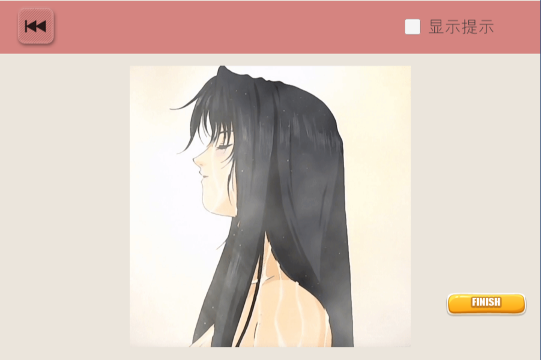
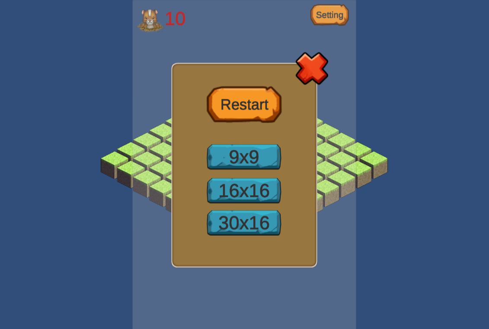
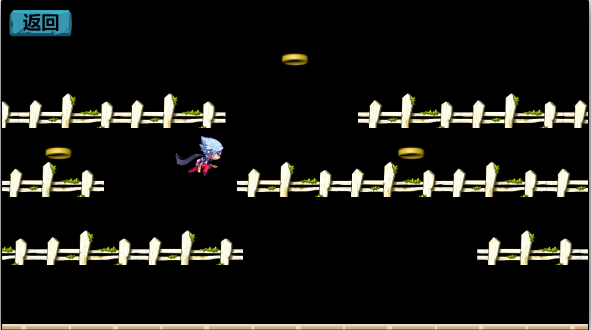

# 游戏

> 点击图片可以试玩

## 动态拼图游戏

开发环境：

* Unity 2018.3

## 田园风格的扫雷游戏

开发环境：

* Unity 2019.3

## 金币骑士

平台跳跃吃金币游戏

开发环境：

* CocosCreator 2.3.3

# 工具

<a href="webui/TrigoCalc.html">三角函数计算器</a>

<a href="webui/pic_auto_split.html">大图拆分</a>

# shader

<a href="shader/index.html">shader第一课</a>

<a href="shader/index_img.html">显示图像</a>

# 其他

## xmlui

* 基于python2.7/wxPython==4.1.0，借鉴了html的编辑方式，使用xml描述ui结构，辅助开发python gui的库
* 教程地址：https://gitee.com/zhangdianwei/xmlui